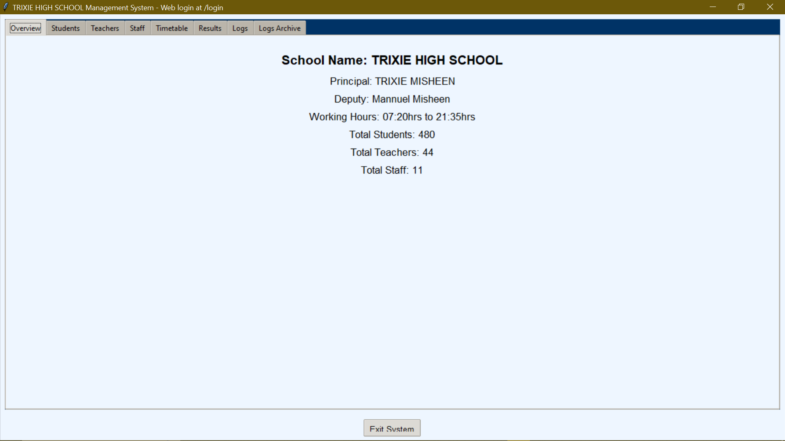
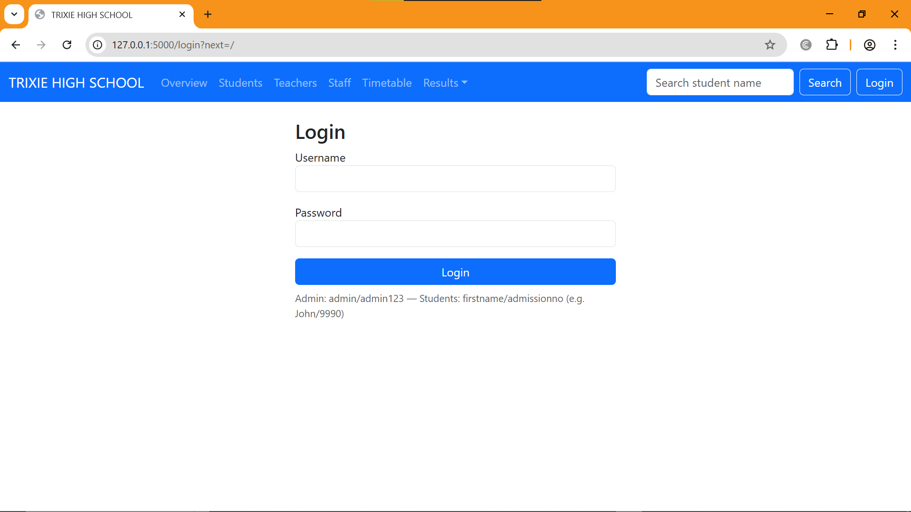
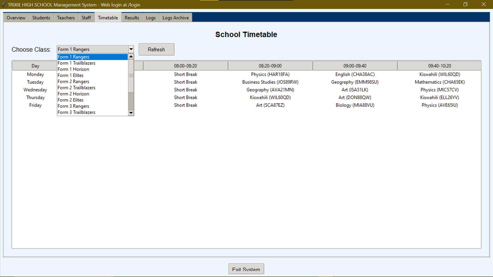
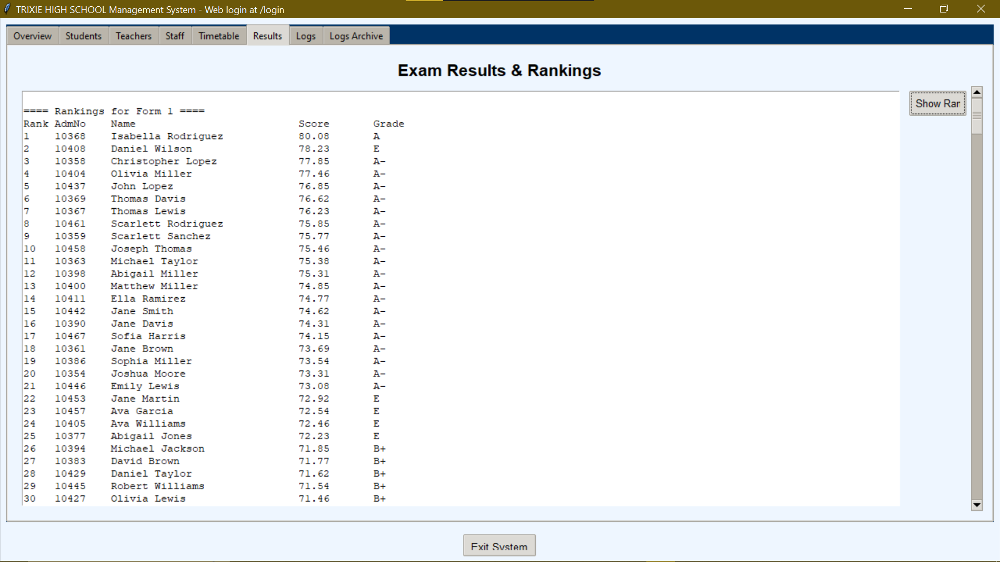

School Management System

A School Management System built with Python, Tkinter, and Flask.
It provides both a desktop interface and a web-based dashboard for managing students, teachers, staff, exams, and timetables.

Features

Students – admission numbers, forms, streams, results.

Teachers – unique IDs, class assignments, subject allocations.

Exams & Results – automatic grading, continuous assessments, term reports.

Timetable – daily/weekly schedules including breaks, games, and prep.

School Overview – staff, leadership, and statistics.

User Authentication – roles for Admin, Teacher, and Student.

Exports & Reports – export results/timetable to CSV or JSON.

Logging System – tracks system activity and auto-archives logs.
Web Dashboard – modern Flask-based website with role-based access.

🖼️ Screenshots

## 🖼️ Screenshots  

### 🎨 Desktop Interface (Tkinter)  
  

### 🌐 Web Dashboard (Flask)  
  

### 📅 Timetable View  
  

### 📚 Exam Results Page  
  

🛠️ Installation
Requirements

Python 3.9+

pip install -r requirements.txt

Clone the repo
git clone https://github.com/TrixieMisheen/School-System-using-python.git
cd School-System-using-python

Install dependencies
pip install flask ttkbootstrap pillow requests

Run the Desktop App
python school_system.py

Run the Web App (Development)
python school_system.py --dev

Run with Production WSGI (Waitress)
python school_system.py --prod --port 8000

👥 User Roles

Admin → Full access to students, teachers, staff, timetable, exams, logs.

Teacher → Can view/manage own schedule and students.

Student → Login with Admission No. to view results and timetable.

📂 Project Structure
school_system.py      # Main script (Tkinter + Flask)
templates/            # HTML templates for web app
static/               # CSS, JS, images
requirements.txt      # Dependencies
README.md             # Project documentation

🚀 Roadmap / Future Features

Mobile-friendly web UI

Email notifications for results

Analytics dashboards

Parent access portal

Contributing

Contributions are welcome! Feel free to fork this repo, open an issue, or submit a pull request.

License

This project is licensed under the MIT License.